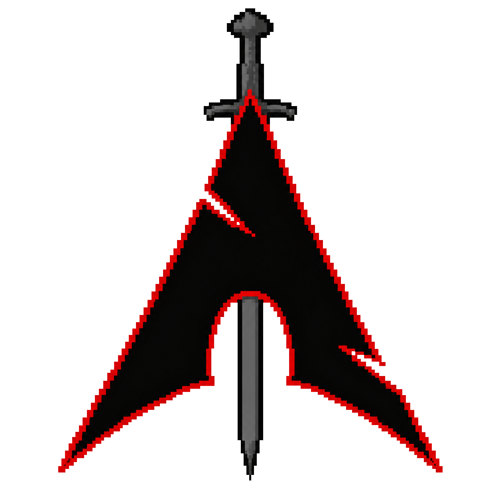

<div align="center">
  
</div>
    
<p align="center">
  
</p>

<p align="center">
    
</p>


## `>(sudojung㉿quantum-node)-[~/identity]`

```bash
└─$ whoami

    ├── Name       : Renzo Cienfuegos
    ├── Alias      : Sudojung / V/ND/X
    ├── Role       : Scientific Computing Student
    ├── University : National University of San Marcos
    ├── Location   : Lima, Peru
    ├── Focus      : Quantum Computing | Cybersecurity | Artificial Intelligence
    ├── Status     : Learning | Researching | Building
```

